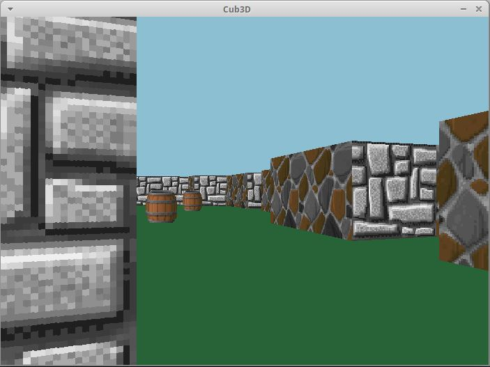

# 🐺 cub3d
A [42 school](https://www.42.fr/) project using the [minilibx-linux from @42Paris](https://github.com/42Paris/minilibx-linux), in which I made a small *ray casting game* in the spirit of [Wolfenstein 3D (1992)](https://en.wikipedia.org/wiki/Wolfenstein_3D) written entirely in C with customisable maps.

📌 [Subject](https://github.com/celeloup/42_cub3d/blob/master/fr.subject.pdf) (April 2020 version)
<p align="center">
	
</p>  
   
## 🛠️ Usage
Linux required.

```shell
# Use the Makefile to compile
make

# Launch the program
./Cub3d file.cub [--save]
```
The `--save` option will take a `.bmp` screenshot of the first frame of the game.   
   
The program requires a map of the game (`.cub`) as input, with the following format :
```
R x y
NO ./path_to_north_texture
SO ./path_to_south_texture
EA ./path_to_east_texture
WE ./path_to_west_texture

S ./path_to_sprite_texture
F r,g,b
C r,g,b

MAP DESCRIPTION
```
Where :
- x and y are positive numbers describing the display *resolution* of the map.
- Textures for the north, south, east and west facing walls and the sprite object are `.xpm` files.
- r,g and b are 8 bit numbers to describe a RGB color for the *floor and ceiling*.
- MAP DESCRIPTION is a grid of 0 and 1 where 1 is a wall and 0 is an empty space.    
A letter (N, S, W or E) MUST be provided somewhere on the map, indicating the player's spawn and its facing direction.  
Sprite objects MAY be added and represented by the number 2.   
The map MUST be closed, meaning it should be surrounded by walls (number 1).

A `.cub` map example may look like :

```
R 700 500
NO textures/wall_1.xpm    
SO textures/wall_2.xpm
WE textures/wall_3.xpm
EA textures/wall_4.xpm
S textures/barrel.xpm
F 39,99,55
C 140,191,209

        1111111111111111111111111
        1000000000110000000000001
        1011000001110000002000001
        1001000000000000000000001
111111111011000001110000000000001
100000000011000001110111111111111
11110111111111011100000010001
11110111111111011101010010001
11000000110101011100000010001
10002000000000001100N00010001
10000002000000110001010010011
1100000111010101111101111000111111
11110111 1110101 10111101000000001
11111111 1111111 11111111111111111
```

If the `.cub` file is not properly formatted, the program will return an error with the first format mistake it detected.  
Some maps (good and bad) are provided in the `/maps` directory as well as some `.xpm` textures in the `/textures` directory.
    
## 🗺️ Features

Cub3D is a *3D engine* that displays personnalized maps in which a player can move around. You can customize the environement by providing textures for the walls and object as well as change the floor and ceiling color.  


   
The user may use the following keys :
Key|Action
---|------
<kbd>Z</kbd>|Move forward
<kbd>Q</kbd>|Move left
<kbd>S</kbd>|Move backward
<kbd>D</kbd>|Move right
<kbd>Right Arrow</kbd>|Turn the camera to the right
<kbd>Left Arrow</kbd>|Turn the camera to the left
<kbd>ESC</kbd>|Quit the program
  
As part of the project requirements, you can also create a [bitmap image file](https://en.wikipedia.org/wiki/BMP_file_format) of the first frame of the game by providing the `--save` command when you launch the program.

> ℹ️ This repository also contains a file `TESTS` filled with written tests you can perform on the game as part of the evaluation of the project.

## 📖 Ressources
Learning about and implementing a ray casting based game is not the simplest task in the world. Fortunately, the internet is filled with very nice people who made very cool and interesting tutorials. Here's some of the ones that I used to help me in my quest of conquering the 3D world.

- [Ray casting in 2D, explained by the marvelous Daniel Shiffman of the Coding Train](https://thecodingtrain.com/challenges/145-ray-casting-2d) (Javascript, p5.js)

- [Ray casting in 3D, presented by the incredible Daniel Shiffman of the Coding Train (I love that guy)](https://thecodingtrain.com/challenges/146-rendering-ray-casting) (Javascript, p5.js)

- [Lode's Computer Graphics Tutorial](https://lodev.org/cgtutor/raycasting.html) (C++)
